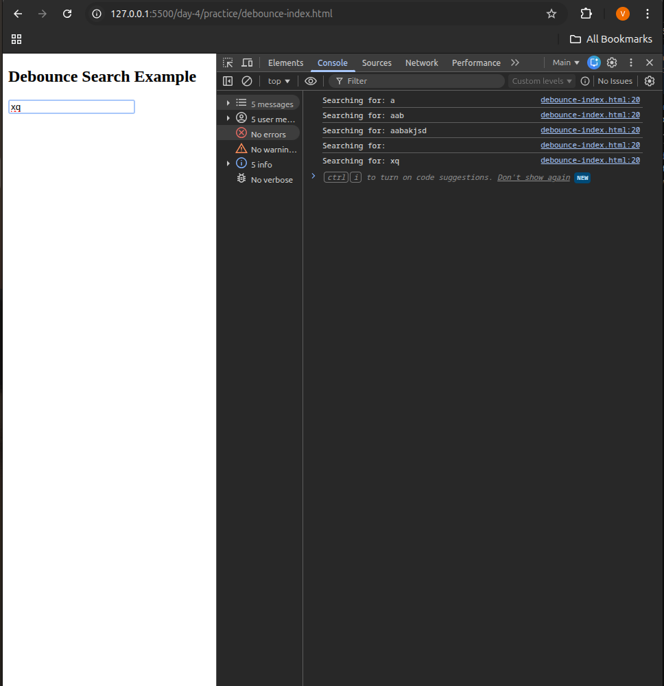
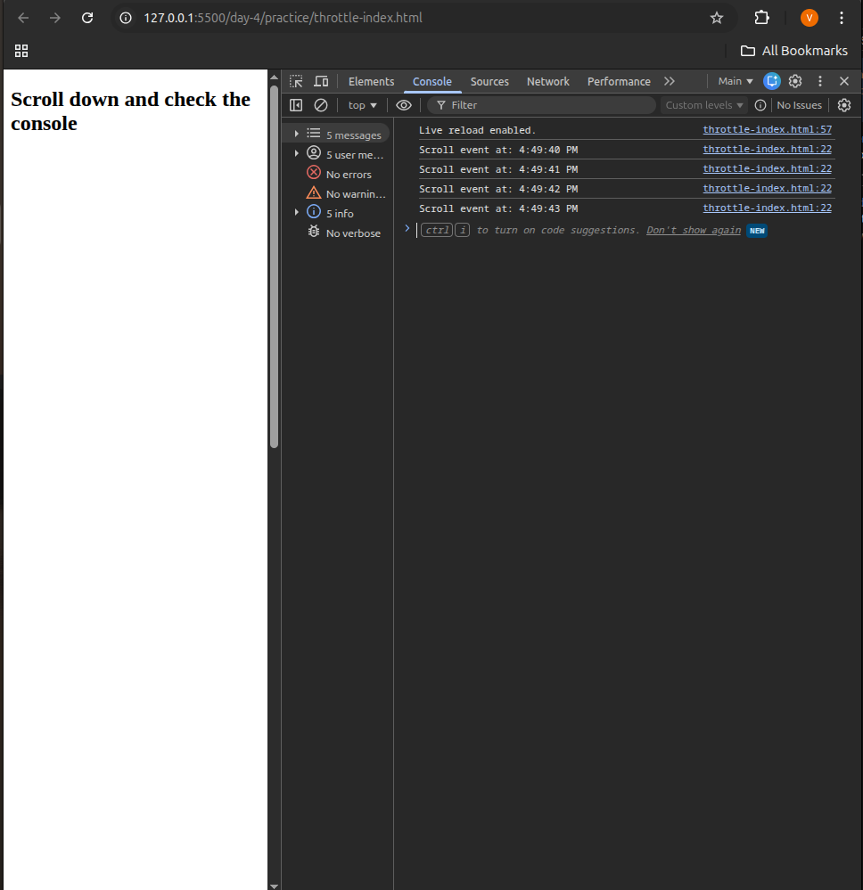

Perfect 👍 You’ve completed all the **Day 4 – JS Utilities + LocalStorage Mini-Project** activities — debounce, throttle, and Todo App with persistence.

Here’s a professional, clean, and well-formatted **README.md** file for your submission (with places to add screenshots 👇):

---

```markdown
# 🧩 Day 4 – JS Utilities + LocalStorage Mini Project

## 🔹 Learning Outcomes
By completing this module, you will:
- Create **custom JavaScript utility functions**: `debounce`, `throttle`, and `groupBy`.
- Understand **performance optimization** in event handling.
- Learn to store and retrieve data using **LocalStorage**.
- Handle **errors** with `try...catch` and maintain app stability.
- Build a **modular, interactive Todo App** that persists data even after a page refresh.

---

## 🧠 Topics & Activities

| Topic | Activity |
|-------|-----------|
| Debugging | Practice with Chrome DevTools (breakpoints, watch, console) |
| JS Utilities | Implement `debounce`, `throttle`, `groupBy` |
| LocalStorage | Save and load data from browser storage |
| Error Handling | Use `try...catch` and log errors gracefully |
| Mini Project | Build a **Todo App** (Add → Edit → Delete → Persist) |

---

## ⚙️ Project Structure

```

/todo-app/
│
├── index.html         # HTML structure for Todo app
├── style.css          # Styling for app interface
├── script.js          # Main logic (CRUD + LocalStorage)
├── debounce.html      # Debounce example demo
├── throttle.html      # Throttle example demo
├── logs/
│   └── errors.md      # Optional: Error handling or debugging notes
└── README.md          # Project documentation

````

---

## 🚀 Features Implemented

### 🕒 1. Debounce Function
Prevents a function from running too frequently (useful for **search inputs**).  
Runs only after a delay when user stops typing.

**Code Demo:**  
```js
function debounce(fn, delay) {
  let timer;
  return function(...args) {
    clearTimeout(timer);
    timer = setTimeout(() => fn.apply(this, args), delay);
  };
}
````

📄 *File:* `debounce.html`
🧩 *Example:* Logs search queries only after typing stops.

---

### ⚡ 2. Throttle Function

Limits how often a function executes within a time frame (useful for **scroll or resize** events).

**Code Demo:**

```js
function throttle(fn, limit) {
  let inThrottle = false;
  return function(...args) {
    if (!inThrottle) {
      fn.apply(this, args);
      inThrottle = true;
      setTimeout(() => inThrottle = false, limit);
    }
  };
}
```

📄 *File:* `throttle.html`
🧩 *Example:* Logs scroll events once every second.

---

### ✅ 3. Todo App with LocalStorage

A simple CRUD app that allows:

* Adding new tasks
* Editing existing tasks
* Deleting tasks
* Persisting tasks on page refresh using **LocalStorage**

📄 *File:* `index.html` + `script.js`

**Core LocalStorage Logic:**

```js
function saveTodos(todos) {
  localStorage.setItem('todos', JSON.stringify(todos));
}

function getTodos() {
  return JSON.parse(localStorage.getItem('todos')) || [];
}
```

**App Features:**

* Add, edit, and delete todos
* Auto-save on every change
* Error handling with `try...catch`
* Clean and responsive UI

---

## 🧩 Screenshots

> 📸 Add your screenshots below (you can drag & drop them into the README on GitHub)

### 🔹 Debounce Example



### 🔹 Throttle Example



### 🔹 Todo App Interface


---

## 💡 Concepts Demonstrated

* **Modular JS Functions**
* **Performance Optimization** with Debounce & Throttle
* **State Persistence** using LocalStorage
* **Dynamic DOM Manipulation**
* **Event Handling (click, input, scroll)**
* **Error Handling (try/catch)**
* **Code Organization and Reusability**

---

## 🧱 Error Handling Example

```js
try {
  renderTodos();
} catch (err) {
  console.error('Render error:', err);
}
```

* Prevents the app from crashing due to unexpected issues.
* Logs errors for debugging.

---

## ✅ Deliverable

**Folder Name:** `/todo-app/`
Should include:

* Debounce + Throttle examples
* Todo App with LocalStorage
* Error handling and documentation
* Screenshots folder (optional but recommended)

---