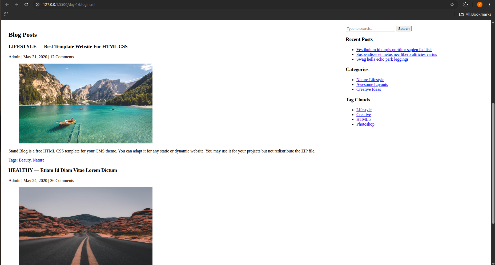

## 📰 Stand Blog — Semantic HTML5 Project

### 📘 Overview

This project is a **semantic HTML5 blog layout** built **without using any `
` or CSS**.
It demonstrates the proper use of **HTML5 structural elements**, **forms**, **media**, and **accessibility features**.
The page layout represents a complete blog — including a header, featured posts, main articles, sidebar, and footer.

---

### 🧱 Project Structure

| Section         | Description                                                                                |
| --------------- | ------------------------------------------------------------------------------------------ |
| **`<header>`**  | Contains the blog title and primary navigation links (Home, About Us, Blog Entries, etc.). |
| **`<section>`** | Used to group related content such as featured posts and promotional banners.              |
| **`<article>`** | Represents independent blog posts and featured entries.                                    |
| **`<main>`**    | Contains the main blog content and sidebar arranged in a table layout.                     |
| **`<aside>`**   | Holds complementary content like search bar, recent posts, categories, and tag clouds.     |
| **`<footer>`**  | Displays social media links and copyright information.                                     |

---

### 🧩 Semantic HTML5 Used

* **Structural Tags:** `<header>`, `<main>`, `<section>`, `<article>`, `<aside>`, `<footer>`, `<nav>`, `<figure>`, `<figcaption>`
* **Text & Metadata Tags:** `<h1>`–`<h3>`, `
`, `<time>`, `<small>`, `<a>`
* **Media:** `` elements are embedded with meaningful `alt` text.
* **Form:** `<form>` includes `<input type="search">` and `<button>` with required validation.

---

### ♿ Accessibility Features

* **ARIA Roles:** `role="banner"`, `role="navigation"`, `role="main"`, `role="complementary"`, `role="contentinfo"`
* **ARIA Labels:** Added via `aria-label` and `aria-labelledby` to describe each section clearly to screen readers.
* **Alt Text:** Every image includes descriptive `alt` attributes.
* **Tab Navigation:** All links and form fields are naturally focusable and accessible.

---

### 💡 Learning Outcomes

By creating this page, I learned:

* The importance of **semantic HTML** for structure and accessibility.
* How to design a complete page layout **without `
` or CSS**.
* How to use **ARIA roles** and **labels** to improve screen reader support.
* How to integrate **forms and media elements** correctly.
* How to make HTML content **readable, navigable, and SEO-friendly**.

---

### 📄 File Included

* `index.html` — Main semantic blog page
* `README.md` — Project documentation

---

### 🚀 How to View

Simply open `index.html` in any modern web browser.
No external dependencies or CSS are required.

---