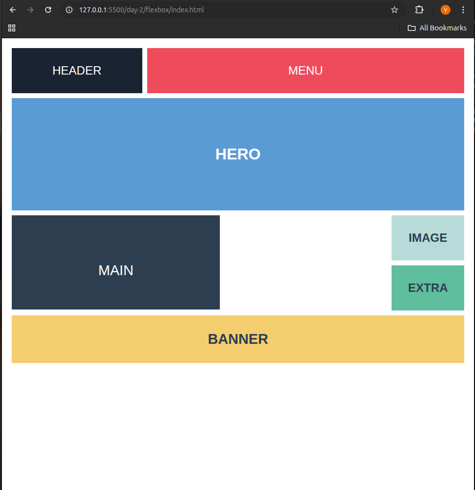
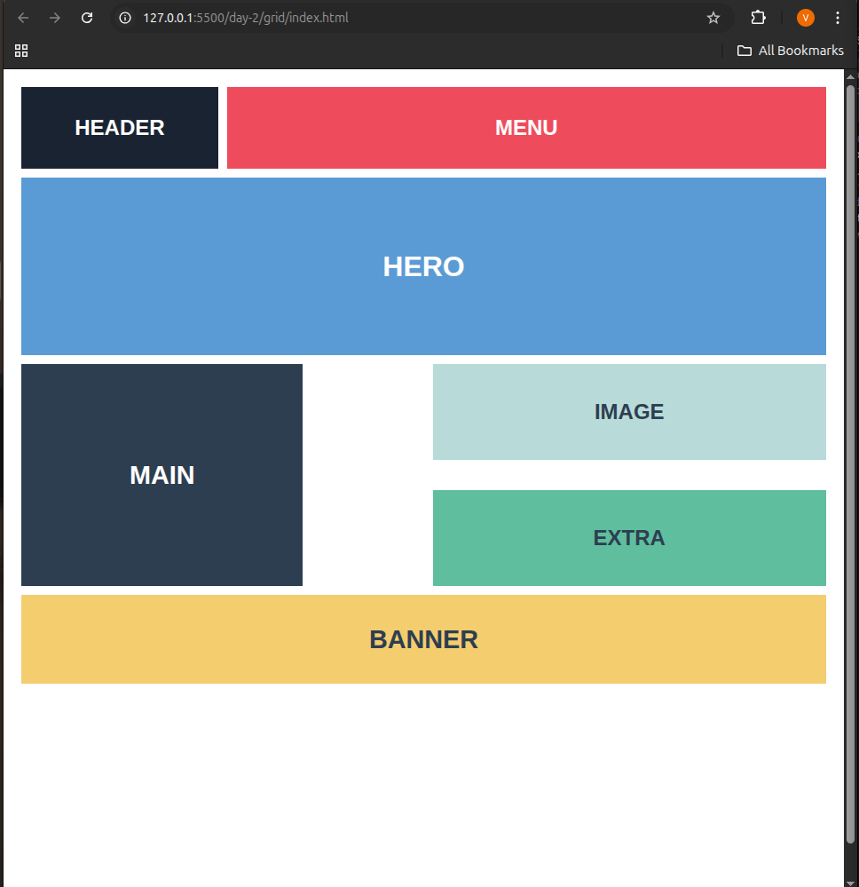

# Responsive Layout Project – CSS Selectors, Flexbox & Grid

## 📘 Overview
This project demonstrates the use of **CSS Selectors, Flexbox, and Grid** to build responsive and semantic web layouts.  
It includes two layout examples — **Flexbox** and **Grid** — both adapting gracefully from desktop to mobile viewports.

---

## Topic Activities

### 1. CSS Selectors & Specificity
- Practiced using different **selectors** (`class`, `id`, `attribute`, `pseudo-class`, `descendant`, etc.).
- Understood how **specificity** determines which styles are applied when multiple selectors target the same element.

### 2. Flexbox Layout
- Built a **Navbar + Hero Section** using Flexbox.
- Created a **content area** with `MAIN` and `SIDEBAR` alignment.
- Used properties like `flex`, `flex-wrap`, `justify-content`, and `align-items` for spacing and alignment.
- Implemented responsive stacking using `@media` queries.

### 3. CSS Grid Layout
- Designed a **product-style grid layout** with rows and columns.
- Adjusted the column count (2 / 3 / 4) based on available screen width using:
  ```css
  grid-template-columns: repeat(auto-fit, minmax(250px, 1fr));
````

* Practiced using `grid-column` and `grid-row` for element placement.

### 4. Responsive Approach

* Adopted **mobile-first** design strategy.
* Ensured layouts adapt fluidly from small screens (single column) to large desktops.
* Used flexible units (`fr`, `%`, `minmax()`) and media queries (`@media`) for scaling.

---

## Features

* 100% pure **HTML5 + CSS3** (no frameworks)
* **Semantic structure**: header, nav, section, main, aside, footer
* **Responsive design**: flex-wrap + grid auto-fit
* Clean spacing, alignment, and color consistency

---

## Responsiveness

| Screen Width   | Layout Behavior                    |
| -------------- | ---------------------------------- |
| > 1024px       | Multi-column grid + horizontal nav |
| 768px – 1024px | Reduced columns, stacked sidebar   |
| < 768px        | Single-column, stacked layout      |

---

## Screenshots

### Flexbox Layout



### Grid Layout



---

## Technologies Used

* **HTML5** – Semantic structure
* **CSS3** – Flexbox, Grid, Media Queries
* **VS Code / Live Server** – Development & testing environment

---


