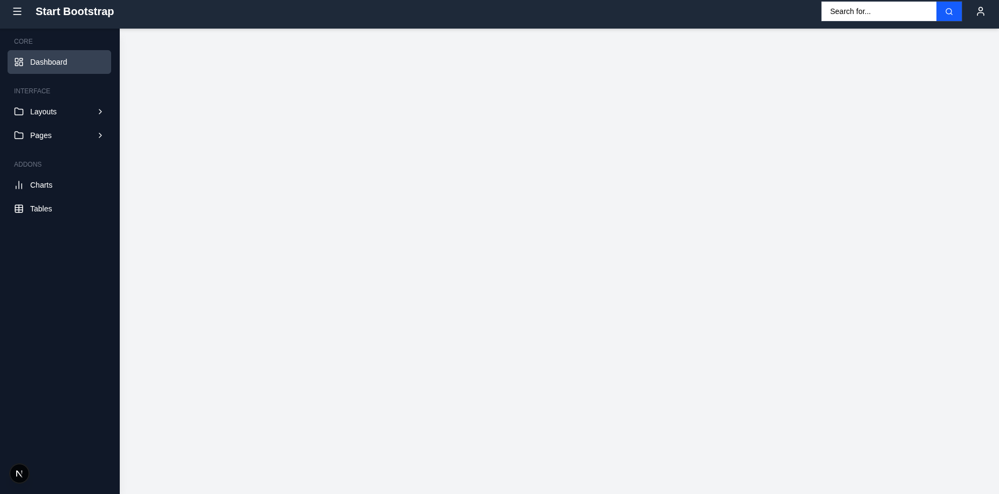
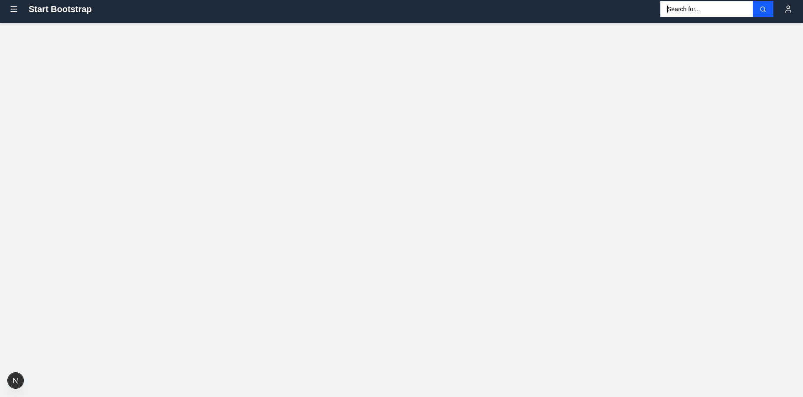

# Day 1 --- TailwindCSS + UI System Basics

## 🔹 Topics Covered

-   Install Tailwind in Next.js\
-   Utility classes (spacing, colors, fonts)\
-   Custom theme configuration

------------------------------------------------------------------------

## 🔹 Exercise

Build a **Dashboard Layout Skeleton** (Header + Sidebar)\
Reference Image:

------------------------------------------------------------------------

## 🔹 Output Structure

    /app/layout.jsx  
    /components/ui/Navbar.jsx  
    /components/ui/Sidebar.jsx  
    /app/page.js

------------------------------------------------------------------------

# 📌 Code Implemented

------------------------------------------------------------------------

## \## `/components/ui/Navbar.jsx`

------------------------------------------------------------------------

## `/components/ui/Sidebar.jsx`

------------------------------------------------------------------------

## `/app/layout.jsx`

------------------------------------------------------------------------

## `/app/page.jsx`

------------------------------------------------------------------------

# ✅ Work Completed Successfully

-   Tailwind installed & configured\
-   Navbar implemented\
-   Sidebar implemented with toggle animation\
-   Layout structure created\
-   Page component connected
