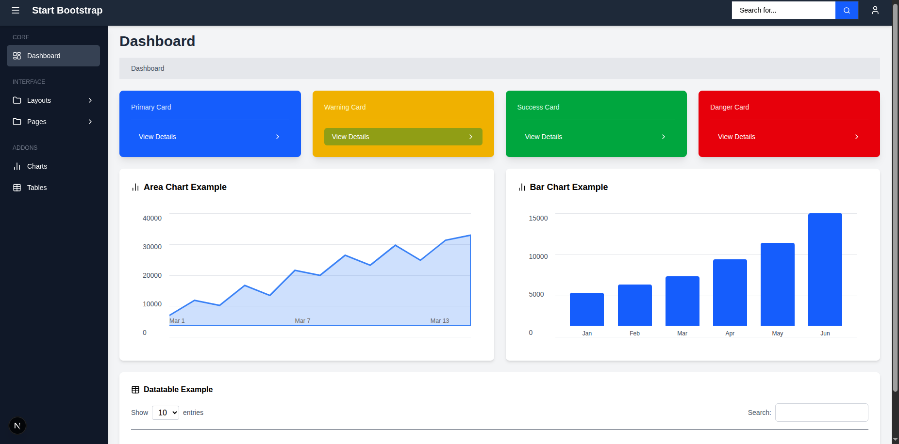

# 📘 Day 2 — Tailwind Advanced + UI Component Library


## ✅ **Topics Covered**

### 🔹 1. Tailwind Advanced

* Flexbox
* Grid layout
* Advanced utility classes
* Spacing, typography, and responsive utilities
* Transitions & hover states

### 🔹 2. Component Mindset

* Understanding atomic design
* Component breakdown
* Passing and handling props
* Reusability and styling consistency

### 🔹 3. UI Component Library

Created inside:

```
/components/ui/
```

Components built:

* **Button.jsx**
* **Card.jsx**
* **Input.jsx**
* **Modal.jsx** (Layout Wrapper)
* **Navbar.jsx**
* **Sidebar.jsx**

---

UI of day-2 tasks



## 📁 **Project Structure**

```
/components
   /ui
      Button.jsx
      Card.jsx
      Input.jsx
      Modal.jsx
      Navbar.jsx
      Sidebar.jsx
/app
   layout.js
   page.js
/globals.css
README.md
```

---

## 🧩 **Components & Their Purpose**

### 1️⃣ **Button Component**

A fully reusable button with support for variants:

* primary
* success
* danger
* warning
* outline

Uses Tailwind for dynamic styling.

---

### 2️⃣ **Card Component**

Reusable card with optional **title** and **children slot**.

---

### 3️⃣ **Input Component**

Reusable input field with:

* Label support
* Placeholder
* Tailwind focus ring

---

### 4️⃣ **Navbar Component**

Features:

* Sidebar toggle button
* Search bar
* User icon

---

### 5️⃣ **Sidebar Component**

Collapsible sidebar with:

* Dashboard link
* Interface section
* Addons
* Dropdown-style items

---

### 6️⃣ **Modal.jsx (Layout Wrapper)**

Not a modal — acts as the **main layout wrapper**:

* Manages sidebar state
* Wraps dashboard pages
* Handles responsive left spacing

---
