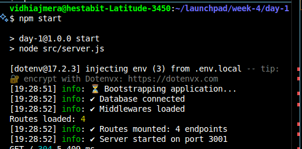

npm init -y

npm install express dotenv mongoose
npm install winston pino pino-pretty
npm install cors morgan helmet compression

mkdir -p src/{config,loaders,models,routes,controllers,services,repositories,middlewares,utils,jobs,logs}

