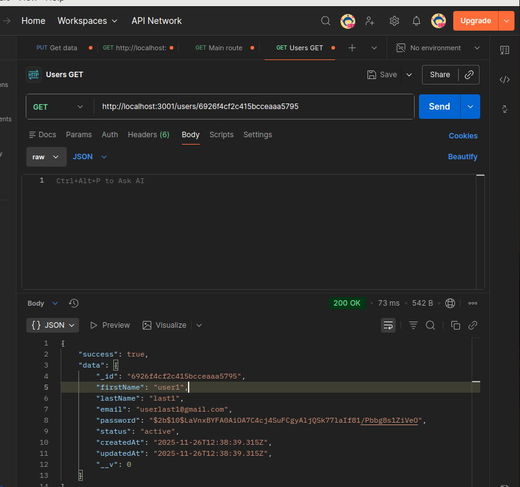
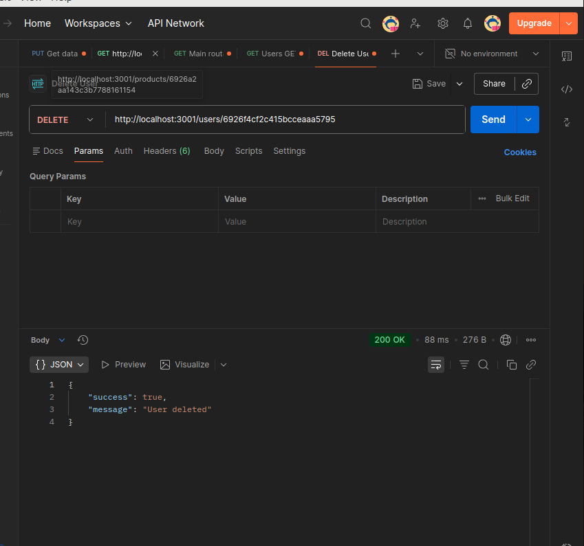
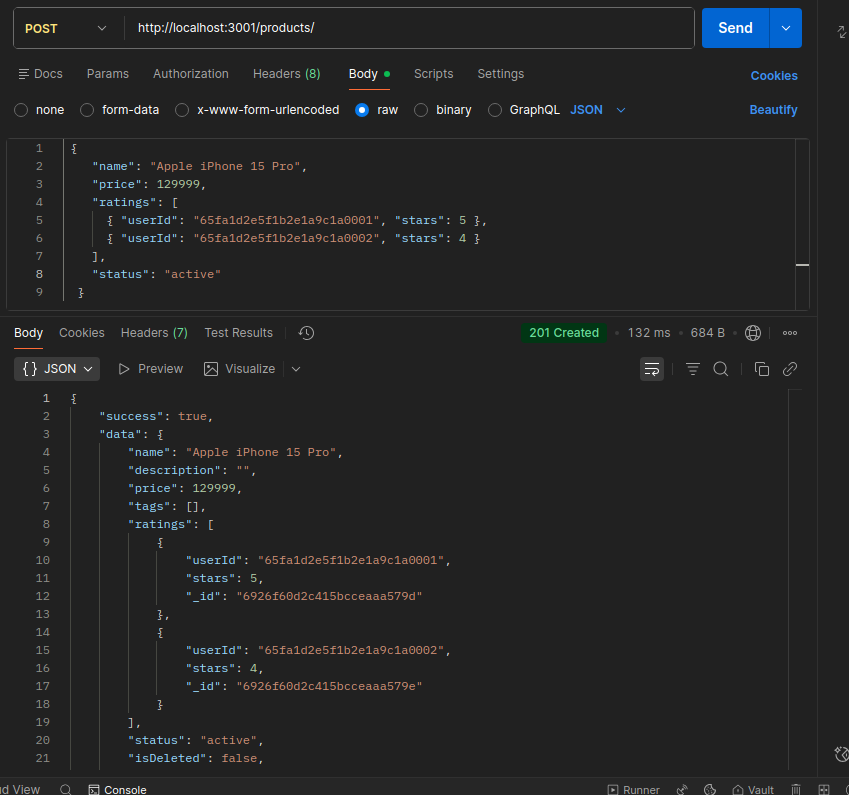

npm init -y

npm install express dotenv mongoose
npm install winston pino pino-pretty
npm install cors morgan helmet compression

mkdir -p src/{config,loaders,models,routes,controllers,services,repositories,middlewares,utils,jobs,logs}

Main endpoint - route

Get all users Endpoint

Post user request 

{
    "firstName":"user1",
    "lastName":"last1",
    "email":"userlast1@gmail.com",
    "password":"098765",
    "status":"active"
}

Get user by ID 

Delete User

Get all products 

Post product request

