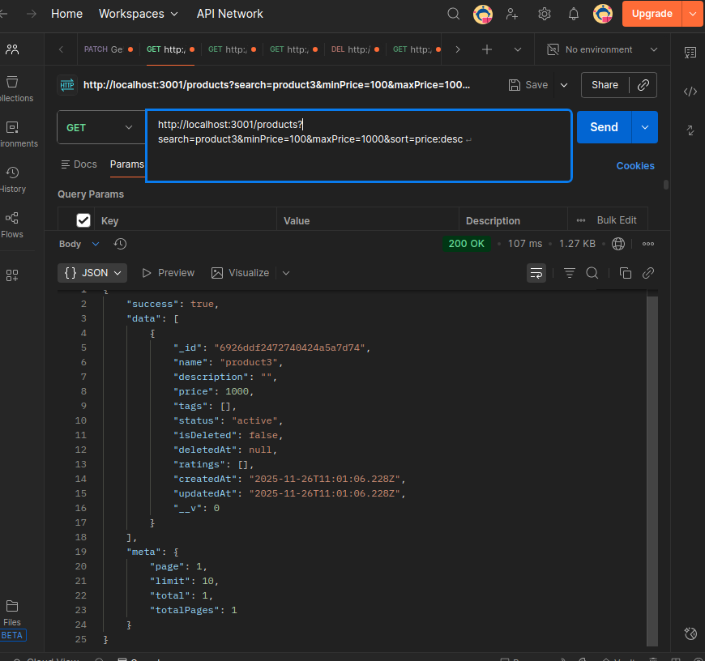
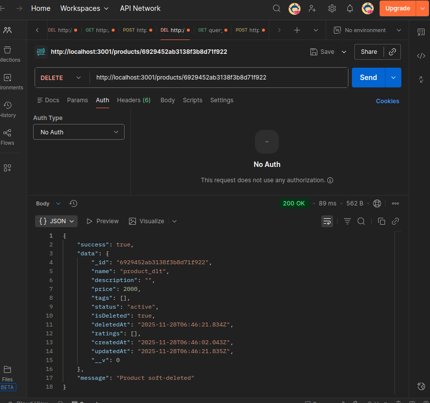

npm init -y

npm install express dotenv mongoose
npm install winston pino pino-pretty
npm install cors morgan helmet compression

mkdir -p src/{config,loaders,models,routes,controllers,services,repositories,middlewares,utils,jobs,logs}

App running :

  
 

 Users endpoint :

  
 

 Post user endpoint :

  
 

 Get user by ID :
 
  
 

 Delete User by ID :

  
 

 Get all products :

  
 
 Post product :
 
 

Get request with complex filters :

Soft delete product functionality :

