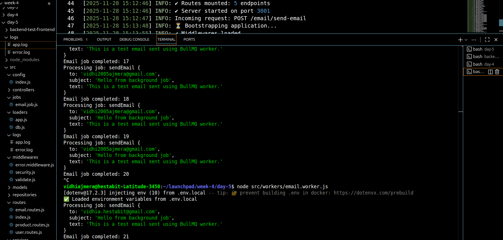
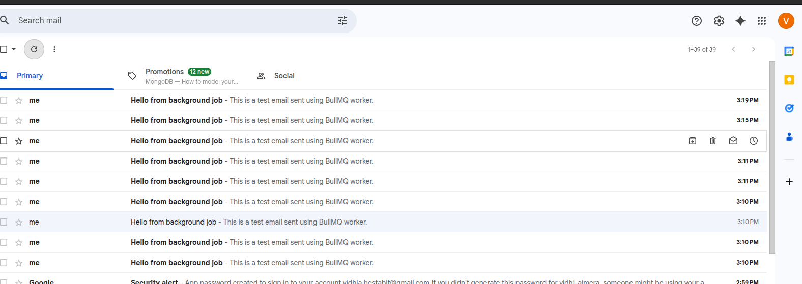

npm init -y

npm install express dotenv mongoose
npm install winston pino pino-pretty
npm install cors morgan helmet compression

mkdir -p src/{config,loaders,models,routes,controllers,services,repositories,middlewares,utils,jobs,logs}

npm install helmet cors express-rate-limit
npm i joi

npm install --save-dev jest supertest cross-env

npm install bullmq ioredis nodemailer

## Email worker:

## Sent Email:

### Access my postman endpoint collection here :-

https://vidhia-hestabit-2290414.postman.co/workspace/Vidhi-Ajmera's-Workspace~b629ae29-2d46-487a-859f-c51a8e4e94b8/collection/49847169-a2ca447e-614f-42b1-b27a-ccd367607ea1?action=share&source=copy-link&creator=49847169