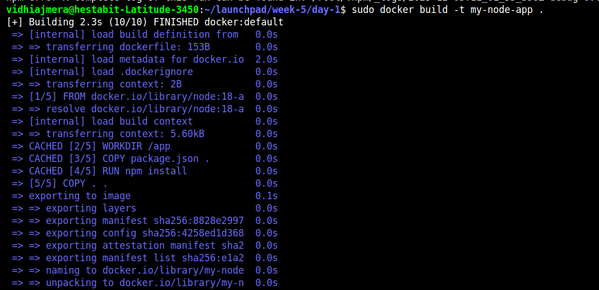
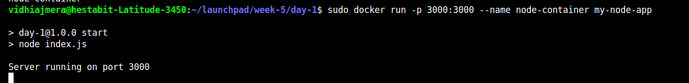
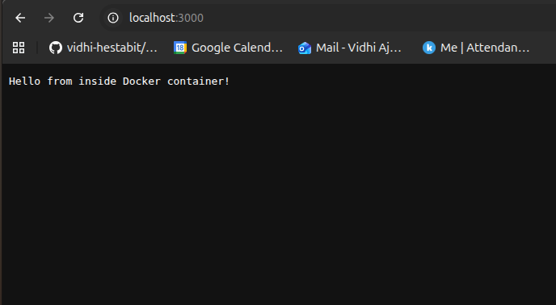

docker build -t my-node-app .
---

# 🐳 What is Docker?

Docker is a platform that allows you to package an application along with:
- its runtime,
- dependencies,
- file system,
- configurations

into a **single portable image**.

Running an image creates a **container**, which is an isolated environment that behaves like a lightweight virtual machine.

---

# 📌 Key Docker Concepts

| Term | Description |
|------|-------------|
| **Image** | A read-only template that contains the application + OS filesystem |
| **Container** | A running instance of an image |
| **Dockerfile** | Script containing instructions to build an image |
| **Volume** | External filesystem for persistence |
| **Network** | Allows containers to communicate |

## ⚙️ How Linux Behaves Inside a Container
A container has:
- its own **filesystem**
- its own **process list (`ps`)**
- its own **users and permissions**
- its own **logs**
- BUT shares **host OS kernel** for speed

---

# 📁 Project Structure

```

day1-docker/
├── Dockerfile
├── package.json
├── index.js
└── linux-in-container.md

````

---

# 🛠 Step-by-Step Setup

## 1️⃣ Create Node.js App

### **package.json**
```json
{
  "name": "docker-node-app",
  "version": "1.0.0",
  "main": "index.js",
  "scripts": {
    "start": "node index.js"
  }
}
````

### **index.js**

```javascript
import http from "http";

const server = http.createServer((req, res) => {
  res.end("Hello from inside Docker container!");
});

server.listen(3000, () => {
  console.log("Server running on port 3000");
});
```

---


Initial Setup :
docker startup -


Port connected from container with local port -






After logout the docker run --- restart the container again -- 

vidhiajmera@hestabit-Latitude-3450:~/launchpad/week-5/day-1$ sudo docker start node-container
node-container


## 2️⃣ Create Dockerfile

### **Dockerfile**

```dockerfile
FROM node:18-alpine
WORKDIR /app
COPY package.json .
RUN npm install
COPY . .
EXPOSE 3000
CMD ["npm", "start"]
```

### 🔍 Explanation

* **FROM node:18-alpine** → lightweight Node.js environment
* **WORKDIR /app** → sets working folder
* **COPY + RUN npm install** → install deps
* **EXPOSE 3000** → app port
* **CMD** → start server

---

## 3️⃣ Build Docker Image

Run inside the project folder:

```bash
docker build -t my-node-app .
```

---

## 4️⃣ Run Docker Container

```bash
docker run -p 3000:3000 --name node-container my-node-app
```

Open the app:

```
http://localhost:3000
```

---

# 🐧 Explore the Container (Linux Internals)

Enter container shell:

```bash
docker exec -it node-container sh
```

Now try:

### 📌 File system

```
ls
ls -la
pwd
```

### 📌 Processes

```
ps
ps aux
```

### 📌 Logs

Inside container:

```
ls /var/log
```

Outside:

```
docker logs node-container
```

### 📌 CPU + RAM usage

```
top
```

### 📌 Users and permissions

```
whoami
cat /etc/passwd
ls -l
```

### 📌 Disk usage

```
df -h
du -sh *
```

Exit:

```
exit
```

---

# 🔧 Useful Docker Commands

| Purpose                 | Command                      |
| ----------------------- | ---------------------------- |
| Show running containers | `docker ps`                  |
| Show ALL containers     | `docker ps -a`               |
| Stop container          | `docker stop name`           |
| Start container         | `docker start name`          |
| Remove container        | `docker rm name`             |
| Remove force            | `docker rm -f name`          |
| Delete image            | `docker rmi my-node-app`     |
| Logs                    | `docker logs node-container` |

---

# 🐛 Troubleshooting

### ❌ Error: "container name already in use"

```
docker rm -f node-container
```

### ❌ Permission denied accessing docker.sock

Use sudo:

```
sudo docker ps
```

Or permanently fix:

```
sudo usermod -aG docker $USER
newgrp docker
```

### ❌ Port already in use (3000)

Use a different port:

```
docker run -p 4000:3000 my-node-app
```

---
