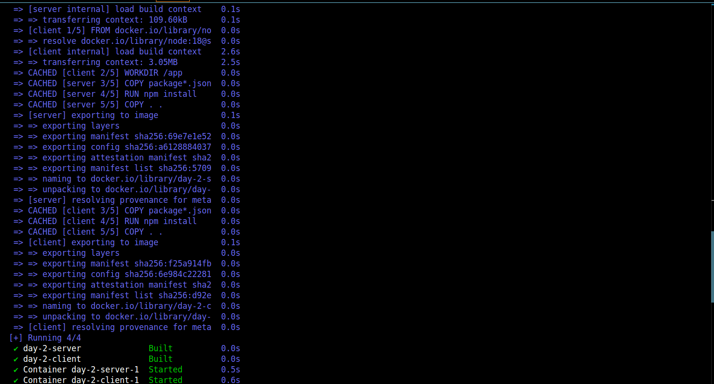
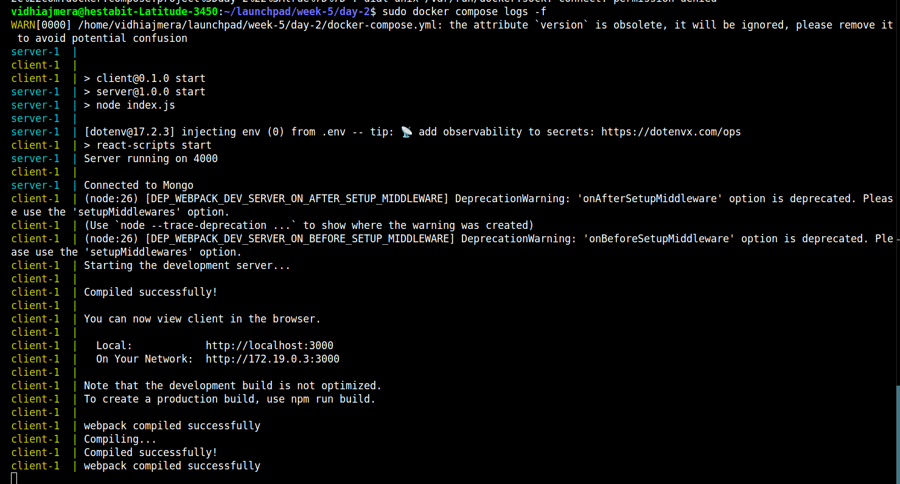
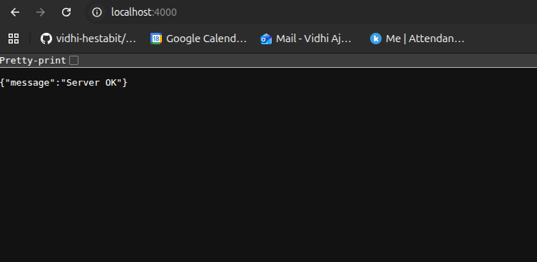
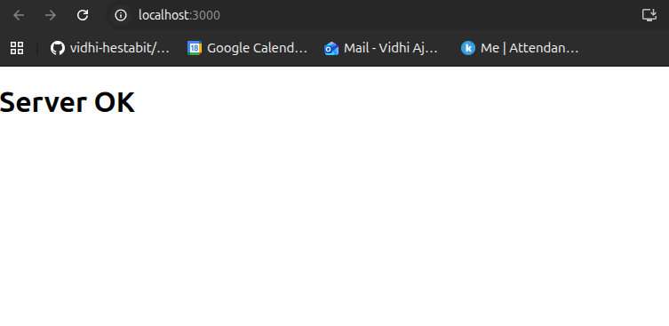
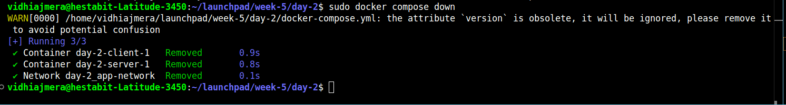
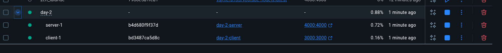
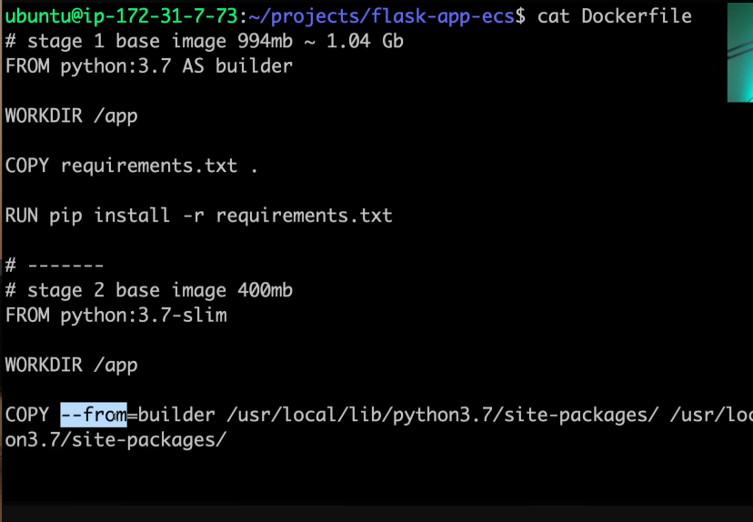
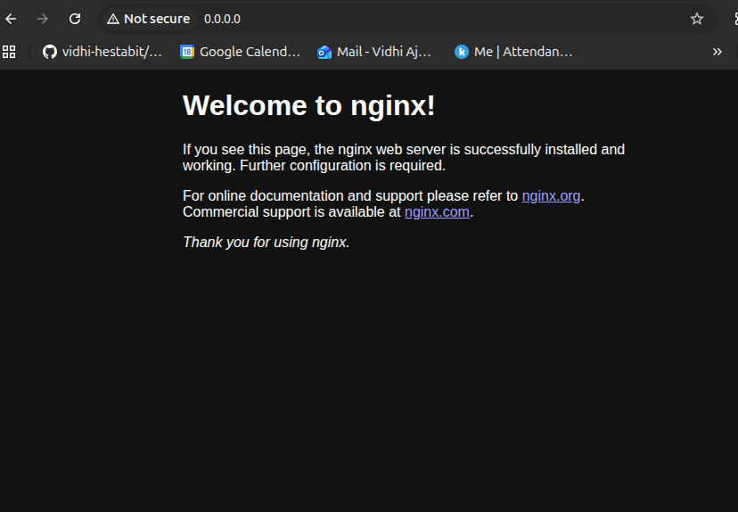
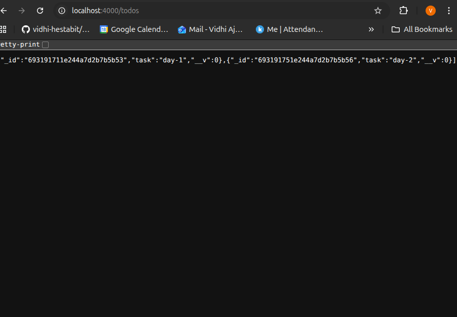
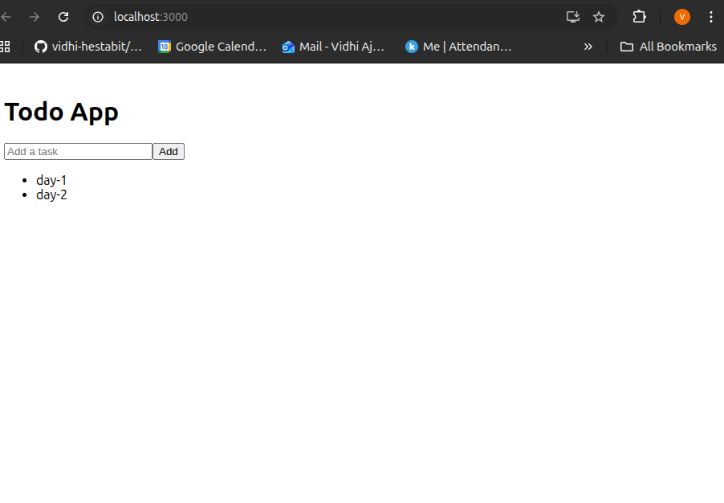

sudo docker compose up -d --build

docker compose logs -f

Stop all servers :

Clean restart :
sudo docker compose up -d --build

Stop and restart :
sudo docker compose stop
sudo docker compose up -- will not rebuild it again!!

Docker desktop setup for day-2 server and client --

-------------------------------------------------

Multi-stage build

---------------------------------------

### Todo App :

Backend localhost:4000/todos -

Frontend localhost:3000 - 

