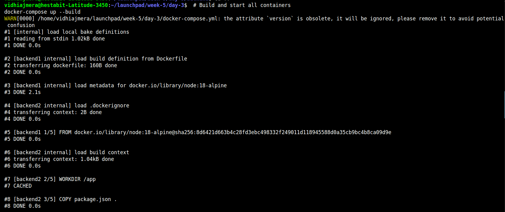
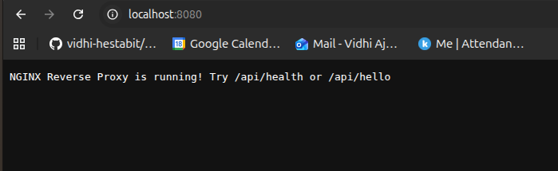
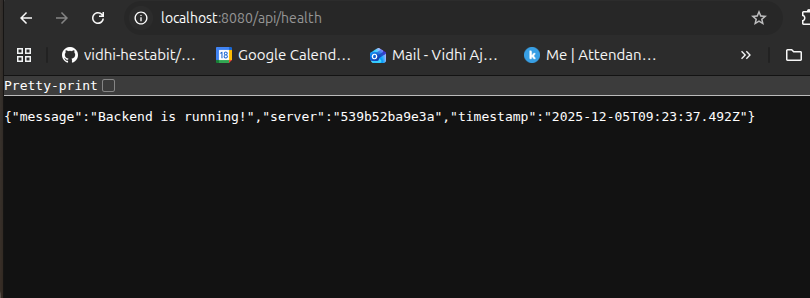
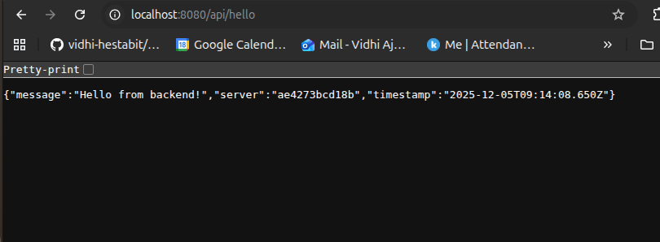
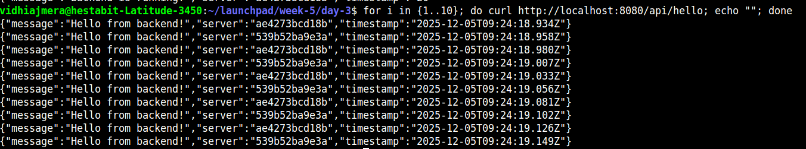
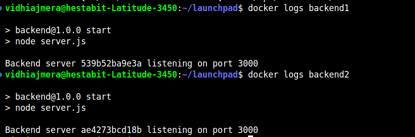

# NGINX Reverse Proxy + Load Balancing :
---

## Project Structure

Create this folder structure:
```
day3-nginx-proxy/
├── backend/
│   ├── server.js
│   ├── package.json
│   └── Dockerfile
├── nginx/
│   └── nginx.conf
└── docker-compose.yml
```

---

## Steps followed :-

### Step 1: Create the Project Folder

Open your terminal and run:
```bash
mkdir day3
cd day3
mkdir backend ngnix
```

---

### Step 2: Create a Simple Backend Application

**Create `backend/server.js`:**
```javascript
const express = require('express');
const app = express();
const port = 3000;

const os = require('os');
const hostname = os.hostname();

app.get('/api/health', (req, res) => {
  res.json({
    message: 'Backend is running!',
    server: hostname,
    timestamp: new Date().toISOString()
  });
});

app.get('/api/hello', (req, res) => {
  res.json({
    message: 'Hello from backend!',
    server: hostname,
    timestamp: new Date().toISOString()
  });
});

app.listen(port, () => {
  console.log(`Backend server ${hostname} listening on port ${port}`);
});
```

**Create `backend/package.json`:**
javascript
```
npm init -y
npm install express
```

**Create `backend/Dockerfile`:**
```dockerfile
FROM node:18-alpine

WORKDIR /app

COPY package.json .
RUN npm install

COPY server.js .

EXPOSE 3000

CMD ["npm", "start"]
```

---

### Step 3: Create NGINX Configuration

**Create `nginx/nginx.conf`:**
```nginx

# Events block - handles connection processing
events {
    # Maximum number of simultaneous connections per worker
    worker_connections 1024;
}

# HTTP block - main configuration for web traffic
http {
    # Define a group of backend servers
    # This is where load balancing happens
    upstream backend-service {
        # Round-robin load balancing (default method)
        # Requests are distributed evenly: 1 → 2 → 1 → 2 → ...
        
        server backend1:3000;  # First backend instance
        server backend2:3000;  # Second backend instance
        
        # Optional: Add more configuration
        # least_conn;  # Use least connections algorithm
        # ip_hash;     # Sticky sessions based on client IP
        # server backend1:3000 weight=2;  # Give more traffic to backend1
    }

    # Server block - defines how to handle requests
    server {
        listen 80;              # Listen on port 80 (HTTP)
        server_name localhost;  # Accept requests for localhost

        # Route all /api/* requests to backend services
        location /api/ {
            # Forward requests to the upstream backend-service group
            proxy_pass http://backend-service;
            
            # Pass original host header to backend
            proxy_set_header Host $host;
            
            # Pass client's real IP address to backend
            proxy_set_header X-Real-IP $remote_addr;
            
            # Pass proxy chain information
            proxy_set_header X-Forwarded-For $proxy_add_x_forwarded_for;
            
            # Optional: Add more headers
            # proxy_set_header X-Forwarded-Proto $scheme;
            
            # Optional: Timeouts
            # proxy_connect_timeout 5s;
            # proxy_send_timeout 10s;
            # proxy_read_timeout 10s;
        }

        # Root path - simple response
        location / {
            return 200 'NGINX Reverse Proxy is running!\nTry:\n  - /api/health\n  - /api/hello\n';
            add_header Content-Type text/plain;
        }

        # Optional: Add a status endpoint
        # location /nginx-status {
        #     stub_status on;
        #     access_log off;
        # }
    }
}

```

---

### Step 4: Create Docker Compose File

**Create `docker-compose.yml` in the root folder:**
```yaml
version: '3.8'

services:
  # First backend instance
  backend1:
    build: ./backend
    container_name: backend1
    networks:
      - app-network

  # Second backend instance
  backend2:
    build: ./backend
    container_name: backend2
    networks:
      - app-network

  # NGINX reverse proxy
  nginx:
    image: nginx:alpine
    container_name: nginx-proxy
    ports:
      - "8080:80"
    volumes:
      - ./nginx/nginx.conf:/etc/nginx/nginx.conf:ro
    depends_on:
      - backend1
      - backend2
    networks:
      - app-network

networks:
  app-network:
    driver: bridge
```

---

### Step 5: Build and Run Everything

In the `day3` folder, run:

```bash
# Build and start all containers
docker-compose up --build
```



---

### Step 6: Test the Setup

**Open a new terminal** and run these commands:

**Test 1: Check NGINX is running**
```bash
curl http://localhost:8080/
```




**Test 2: Test load balancing (run multiple times)**
```bash
curl http://localhost:8080/api/health
```


**Test 3: Another endpoint**
```bash
curl http://localhost:8080/api/hello
```


---

### Step 7: Verify Load Balancing in Action
Hitting the API 10 times -- here 2 backend servers performing the switch..

```bash
for i in {1..10}; do curl http://localhost:8080/api/health; echo ""; done
```


---

### Step 8: View Container Logs

**See NGINX logs:**
```bash
docker logs nginx-proxy
```

**See backend logs:**
```bash
docker logs backend1
docker logs backend2
```


---

### Step 9: Stop Everything

When you're done testing:
```bash
# Stop and remove all containers
docker-compose down
```

---

## Understanding What Happened

### What is a Reverse Proxy?
- **Normal scenario**: Your browser talks directly to your backend server
- **With reverse proxy**: Your browser talks to NGINX, and NGINX forwards the request to the backend
- **Why?** Security, load balancing, SSL termination, caching

### What is Load Balancing?
- Distributing requests across multiple servers
- **Round-robin**: Requests go to Server 1, then Server 2, then Server 1, etc.
- **Benefits**: Better performance, fault tolerance

### How Our Setup Works
```
Browser → http://localhost:8080/api/health
          ↓
     NGINX Proxy (port 80 inside container)
          ↓
     upstream backend-service
          ↓
     Round-robin between:
     - backend1:3000
     - backend2:3000
```

---