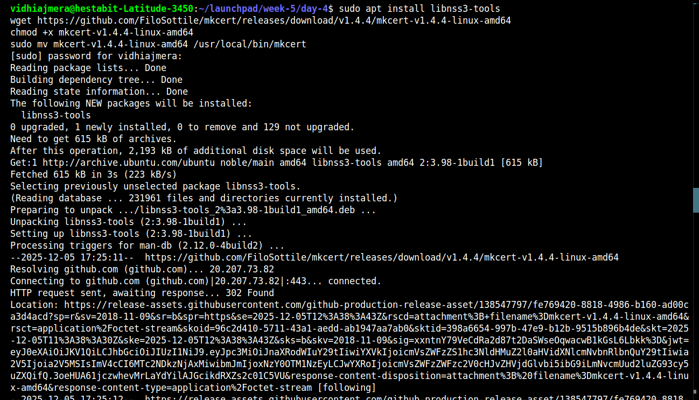
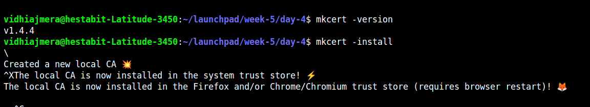
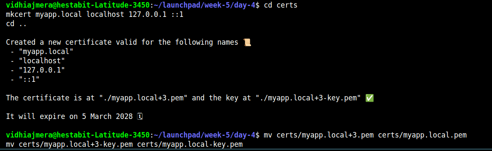
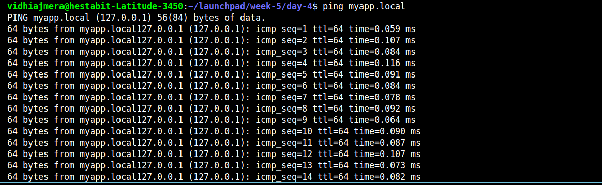
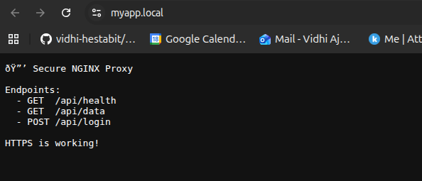
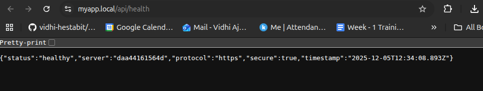
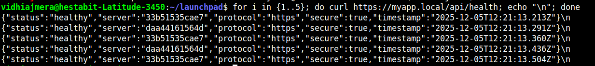

# Day 4 - SSL/TLS + HTTPS Setup with mkcert
---
### What is SSL/TLS?
- **SSL** (Secure Sockets Layer) / **TLS** (Transport Layer Security)
- Encrypts data between browser and server
- Prevents eavesdropping and tampering
- Shows the lock icon in browsers

### HTTP vs HTTPS
```
HTTP  (Port 80)  → Unencrypted → Anyone can read your data
HTTPS (Port 443) → Encrypted   → Data is secure
```

### Why mkcert?
- **Self-signed certs** → Browser shows scary warnings
- **mkcert** → Creates locally-trusted certificates → No warnings!
- Perfect for development environments

---

## Project Structure

```
day4-https-setup/
├── certs/
│   ├── myapp.local.pem
│   └── myapp.local-key.pem
├── nginx/
│   └── nginx.conf
├── backend/
│   ├── server.js
│   ├── package.json
│   └── Dockerfile
├── docker-compose.yml
└── ssl-setup.md
```

---

## Step-by-Step Instructions

### Step 1: Install mkcert

mkcert is a tool that creates locally-trusted SSL certificates.

**On Linux (Ubuntu/Debian):**
```bash
sudo apt install libnss3-tools
wget https://github.com/FiloSottile/mkcert/releases/download/v1.4.4/mkcert-v1.4.4-linux-amd64
chmod +x mkcert-v1.4.4-linux-amd64
sudo mv mkcert-v1.4.4-linux-amd64 /usr/local/bin/mkcert
```



**Verify installation:**
```bash
mkcert -version
```

### Step 2: Install Local Certificate Authority

This makes your browser trust certificates created by mkcert:

```bash
mkcert -install
```



---


---

### Step 3: Create Project Structure

```bash
mkdir day4
cd day4
mkdir certs nginx backend
```

---

### Step 4: Generate SSL Certificates

We'll create certificates for a local domain called `myapp.local`:

```bash
cd certs
mkcert myapp.local localhost 127.0.0.1 ::1
cd ..
```



**What this does:**
- Creates two files:
  - `myapp.local+3.pem` → Certificate (public key)
  - `myapp.local+3-key.pem` → Private key
- Valid for: myapp.local, localhost, 127.0.0.1, ::1

**Rename files for clarity:**
```bash
mv certs/myapp.local+3.pem certs/myapp.local.pem
mv certs/myapp.local+3-key.pem certs/myapp.local-key.pem
```

---

### Step 5: Configure Local Domain

Add the domain to your hosts file:

```bash
sudo nano /etc/hosts
```

**Add this line:**
```
127.0.0.1    myapp.local
```

**Test it:**
```bash
ping myapp.local
```


---

### Step 6: Create Backend Application

**Create `backend/server.js`:**

**Create `backend/package.json`:**

**Create `backend/Dockerfile`:**

---

### Step 7: Configure NGINX with SSL

**Create `nginx/nginx.conf`:**

---

### Step 8: Create Docker Compose Configuration

**Create `docker-compose.yml`:**

---

### Step 9: Start Everything

```bash
# Build and start all containers
docker-compose up --build -d


```
3 containers: nginx-https, backend1, backend2

---

### Step 10: Test HTTP to HTTPS Redirect

**Test 1: HTTP redirect (using curl)**
```bash
curl -v http://myapp.local/
```


**Test 2: HTTPS endpoint (curl)**
```bash
curl https://myapp.local/api/health
```


**Test 3: Check SSL certificate**
```bash
curl -v https://myapp.local/ 2>&1 | grep "subject:"
```

---

### Step 11: Test in Browser

**Open your browser and visit:**

1. **http://myapp.local** → Should redirect to https://myapp.local
2. **https://myapp.local** → Should show secure lock


- Green lock icon in address bar
- "Connection is secure"
- No certificate warnings

**Click the lock icon to view certificate details!**

---

### Step 12: Test API Endpoints

**In browser or using curl:**

```bash
# Health check
curl https://myapp.local/api/health

# Get data
curl https://myapp.local/api/data

# Post request
curl -X POST https://myapp.local/api/login \
  -H "Content-Type: application/json" \
  -d '{"username":"alice","password":"secret123"}'
```

**Test load balancing:**
```bash
for i in {1..5}; do curl https://myapp.local/api/health; echo "\n"; done
```


---

### Step 13: View Logs

```bash
# NGINX logs
docker logs nginx-https

# Backend logs
docker logs backend1
docker logs backend2

# Follow logs in real-time
docker logs -f nginx-https
```
