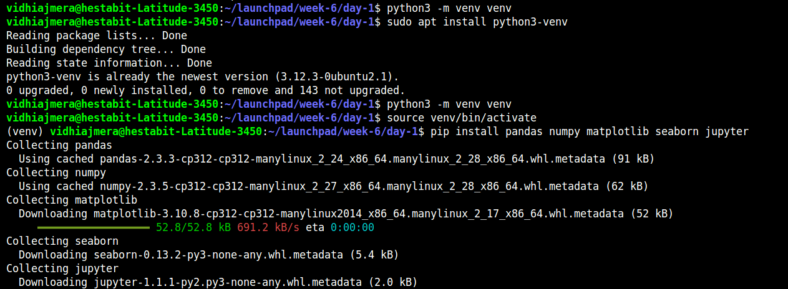
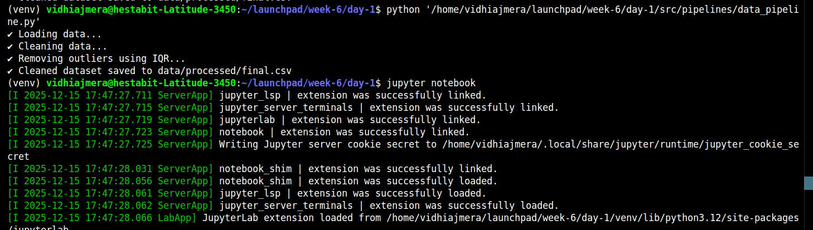

## 📄 `DATA-REPORT.md`

````md
# DATA REPORT — Titanic Dataset (Day 1)

## Project Overview
This project focuses on building a basic data pipeline and performing exploratory data analysis (EDA) as part of Day-1 ML engineering tasks.

The goal is to:
- Load raw data
- Clean and preprocess it
- Generate a clean dataset
- Perform basic EDA to understand the data

---

## Dataset Information

- **Dataset Name:** Titanic Dataset
- **Source:** Kaggle  
  https://www.kaggle.com/datasets/yasserh/titanic-dataset
- **Original File Name:** titanic.csv
- **Renamed As:** `dataset.csv`
- **Location:** `data/raw/dataset.csv`

The dataset contains passenger information such as age, class, fare, and survival status.

---

## Environment Setup

### Python Setup
```bash
sudo apt install python-is-python3
python --version
````

### Virtual Environment

A virtual environment was created to avoid system-level dependency issues.

```bash
python3 -m venv venv
source venv/bin/activate
```



### Required Libraries

```bash
pip install pandas numpy matplotlib seaborn jupyter
```

---

## Data Pipeline Implementation

### Script Location

```
pipelines/data_pipeline.py
```




### Tasks Performed

1. **Load Dataset**

   * Data is loaded from `data/raw/dataset.csv`

2. **Data Cleaning**

   * Duplicate rows removed
   * Missing numerical values filled using median
   * Missing categorical values filled using mode
   * Outliers removed using the IQR (Interquartile Range) method

3. **Save Cleaned Data**

   * Final cleaned dataset saved as:

     ```
     data/processed/final.csv
     ```

### Pipeline Execution

```bash
python pipelines/data_pipeline.py
```

---

## Exploratory Data Analysis (EDA)

### Notebook Location

```
notebooks/EDA.ipynb
```

The EDA was performed using Jupyter Notebook.

### Analysis Performed

#### 1. Missing Values Heatmap

* Verified missing values after preprocessing
* Result: No missing values found in the cleaned dataset

#### 2. Correlation Matrix

* Visualized correlations between numerical features
* Helped identify relationships between variables

#### 3. Feature Distributions

* Histograms plotted for numerical features
* Observed skewness and data spread

#### 4. Target Distribution

* Count plot for the target variable `Survived`
* Observed class imbalance (fewer survivors than non-survivors)

---

## Key Observations

* Dataset contains **561 rows** after cleaning
* Target variable (`Survived`) is **imbalanced**
* `PassengerId` is an identifier and not useful for prediction
* `Parch` has zero variance and does not contribute useful information
* `Fare` is right-skewed and will require scaling in later stages

---

## Conclusion

The dataset has been successfully:

* Loaded from raw source
* Cleaned and preprocessed
* Saved in a structured format
* Analyzed using basic EDA techniques

The data is now **ready for feature engineering and model training**, which will be covered in the next stage of the project.

---