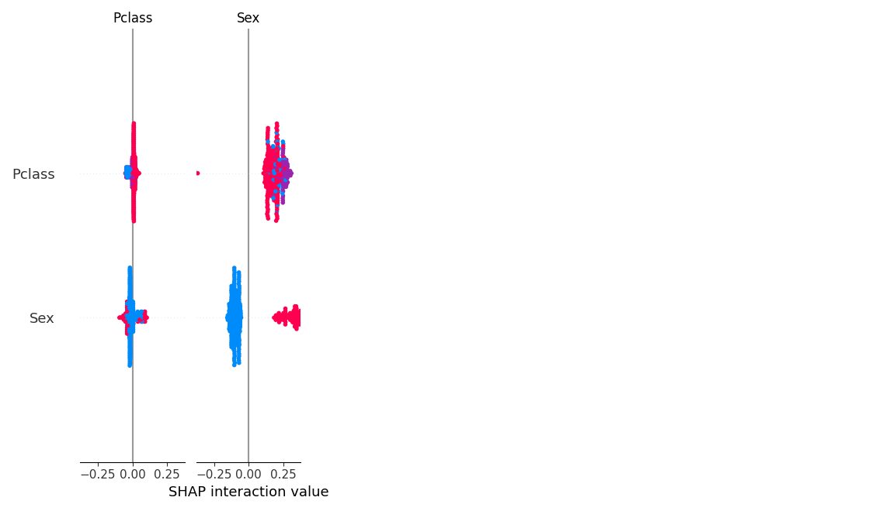

# Model Interpretation and Hyperparameter Tuning

### Objective

The objective of hyperparameter tuning is to find the optimal configuration of a **Random Forest Classifier** that maximizes the model’s ability to distinguish between classes.

ROC-AUC was chosen as the evaluation metric because:
- It is threshold-independent
- It performs well on imbalanced datasets
- It measures ranking quality rather than raw accuracy

---

### Model Used

```python
RandomForestClassifier(random_state=42)
````

Random Forest was selected due to:

* Robustness to outliers
* Ability to model non-linear relationships
* Built-in feature importance estimation
* Strong baseline performance for tabular data

---

### Hyperparameter Search Space

```python
param_grid = {
    "n_estimators": [100, 200, 300],
    "max_depth": [4, 6, 8],
    "min_samples_split": [2, 5],
    "min_samples_leaf": [1, 2]
}
```

**Explanation of parameters:**

* `n_estimators`: Number of trees in the forest
* `max_depth`: Controls tree complexity and overfitting
* `min_samples_split`: Minimum samples required to split a node
* `min_samples_leaf`: Minimum samples required at a leaf node

---

### Cross-Validation Strategy

* 5-fold cross-validation
* Each parameter combination evaluated across 5 splits
* Final score is the average ROC-AUC across folds

This ensures:

* Stable performance estimates
* Reduced variance
* Protection against overfitting to a single split

---

### Tuning Execution

```python
GridSearchCV(
    estimator=rf,
    param_grid=param_grid,
    cv=5,
    scoring="roc_auc",
    n_jobs=-1
)
```

* `n_jobs=-1` enables parallel execution across all CPU cores
* Results are reproducible due to fixed random seed

---

### Tuning Results

The best-performing model parameters and cross-validation score are saved to:

```
/tuning/results.json
```

Example structure:

```json
{
    "best_params": {
        "n_estimators": 200,
        "max_depth": 6,
        "min_samples_split": 2,
        "min_samples_leaf": 1
    },
    "best_score": 0.86
}
```

---

## Model Interpretation (SHAP Analysis)

### Why SHAP?

SHAP (SHapley Additive exPlanations) is used to:

* Explain individual predictions
* Quantify feature contributions
* Ensure model decisions are transparent

Unlike feature importance, SHAP:

* Accounts for feature interactions
* Is grounded in game theory
* Works at both global and local levels

---

### SHAP Analysis Workflow

Implemented in:

```
/evaluation/shap_analysis.py
```

Steps:

1. Load trained Random Forest model
2. Initialize SHAP TreeExplainer
3. Compute SHAP values on validation data
4. Generate global and local explanation plots

---

#### SHAP Analysis :



---
