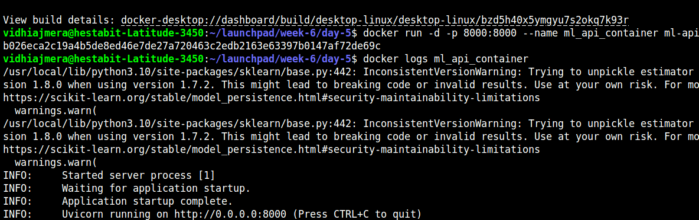

# Day 5 — Model Deployment & Monitoring
```

day-5/
│
├── deployment/
│   ├── api.py
│   └── Dockerfile
│
├── monitoring/
│   └── drift_checker.py
│
├── src/
│   ├── models/
│   │   └── best_model.pkl
│   └── data/
│       └── processed/
│           └── X_train.csv
│
├── prediction_logs.csv
└── DEPLOYMENT-NOTES.md

````

---

---

## Build Docker Image

Dockerfile is located inside `deployment/`, so build using:

```bash
docker build -t ml-api -f src/deployment/Dockerfile .
```

---

## Run ML API Container

```bash
docker run -d -p 8000:8000 --name ml_api_container ml-api
```

Check logs:

```bash
docker logs ml_api_container
```

Expected output:

```
Uvicorn running on http://0.0.0.0:8000
```


---

## API Testing

### Health Check

```bash
curl http://localhost:8000/
```

Response:

```json
{"status":"API is running"}
```

### Prediction Request

```bash
curl -X POST http://localhost:8000/predict \
  -H "Content-Type: application/json" \
  -d '{"features":[0.2,-1.1,0.4,0.7,-0.3,1.2,0.9,-0.6,0.1,0.5]}'
```

Response:

```json
{
  "prediction": 1,
  "probability": 0.87
}
```

---

## Prediction Logging

Predictions are automatically appended to:

```
prediction_logs.csv
```

Check logs:

```bash
cat prediction_logs.csv
```

---

## Drift Monitoring

Run feature drift detection using KS-test:

```bash
python monitoring/drift_checker.py
```

Output example:

```
Drifted Features: ['Fare_log', 'Age_Fare']
```

---

## Stop & Cleanup Container

```bash
docker stop ml_api_container
docker rm ml_api_container
```

---
```

---