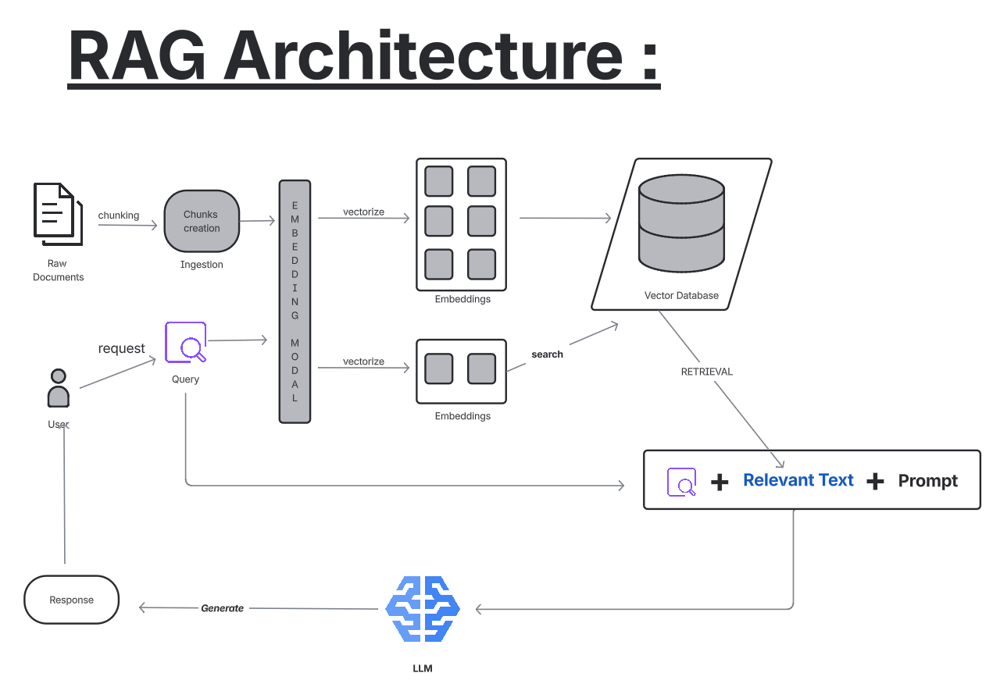

# Day-1 RAG-ARCHITECTURE

## High-Level RAG Flow

```
User Query
   ↓
Query Encoder
   ↓
Retriever (Vector DB)
   ↓
Relevant Context
   ↓
Prompt Builder
   ↓
LLM Generator
   ↓
Final Answer
```

Architecture :



---

## Project Folder Structure

```
day_1/
│
├── src/
│   ├── data/
│   │   ├── raw/                 # Raw input documents (PDFs)
│   │   └── chunks/              # Generated chunks
│   │       └── chunks.json
│   │
│   ├── utils/
│   │   └── document_loader.py   # Loads PDF/TXT/DOCX documents
│   │
│   ├── pipelines/
│   │   └── ingest.py            # Chunking + embedding + indexing pipeline
│   │
│   ├── embeddings/
│   │   └── embedder.py          # Embedding model wrapper
│   │
│   ├── vectorstore/
│   │   └── index_faiss.py       # FAISS index + metadata storage
│   │       ├── index.faiss
│   │       └── metadata.json
│   │
│   └── retriever/
│       └── query_engine.py      # Retrieval + LLM inference
│
├── requirements.txt
└── .gitignore
```

---

## Models Used

### 🔹 Embedding Model

* **`sentence-transformers/sentence-t5-base`**
* Converts document chunks and user queries into dense vector representations.

### 🔹 LLM Model

* **`llama-3.1-8b-instant`**
* Generates final answers using retrieved contextual information.

---

## Vector Store: FAISS

### FAISS Normalization

The following FAISS utility is used during indexing/search:

**`faiss.normalize_L2`**

* Performs **L2 normalization** on vectors **in-place**
* Ensures each vector has unit length
* Enables cosine similarity behavior when using L2 distance
* Improves retrieval quality and stability

---