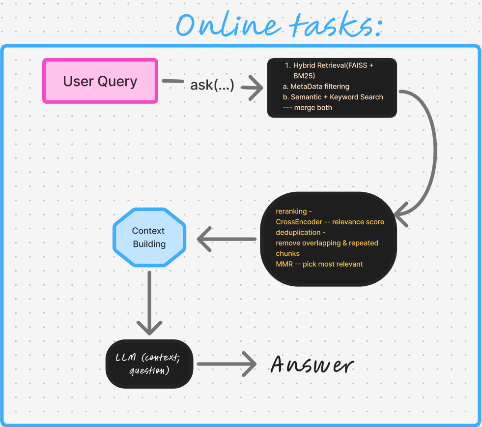

# Hybrid Retrieval-Augmented Generation (RAG) System

### Online (Run-time) Architecture

At query time, the system performs the following steps:

1. User submits a natural language question
2. Query is embedded using a SentenceTransformer model
3. FAISS vector search retrieves top candidate chunks
4. Cross-Encoder reranker reorders candidates by relevance
5. Top-ranked chunks are assembled into a context
6. LLM generates an answer using **only retrieved context**

#### Architecture for the Online tasks (performed at Run-time) -



---

### Offline Architecture

Offline processing prepares the knowledge base:

1. Documents are loaded from `data/raw`
2. Text is split into overlapping chunks
3. Chunks are embedded using a sentence embedding model
4. Embeddings are stored in a FAISS index
5. Chunk metadata is persisted for retrieval

#### Architecture for the Offline tasks (performed at Compile-time) -


---


## Models Used

### Embedding Model

* **sentence-transformers/all-MiniLM-L6-v2**
* Used for document and query embeddings

### Reranking Model

* **cross-encoder/ms-marco-MiniLM-L-6-v2**
* Improves retrieval precision by scoring (query, chunk) pairs

### LLM

* Configured via environment variable `MODEL`
* Used strictly for answer generation from retrieved context

---

## Core Components

### 1. GeminiEmbedder

Encodes text into dense vector embeddings using SentenceTransformers.

### 2. Chunking Pipeline

* Uses `RecursiveCharacterTextSplitter`
* Chunk size: 800 tokens
* Overlap: 100 tokens

### 3. FAISS Vector Store

* Index type: `IndexFlatL2`
* Stores embeddings and chunk metadata
* Supports persistent storage and reload

### 4. HybridRetriever

* Performs semantic search over FAISS index
* Retrieves top-k candidate chunks

### 5. Reranker

* Cross-encoder reranks retrieved chunks
* Selects the most relevant context passages

### 6. QueryEngine

* Orchestrates retrieval, reranking, and LLM calls
* Builds citation-aware context
* Enforces strict RAG rules

---


## Folder Structure

```
project-root/
│
├── data/
│   ├── raw/           # Input documents (PDF, DOCX, TXT)
│   └── chunks/        # Generated text chunks
│
├── src/
│   ├── embeddings/    # Embedding logic
│   ├── retriever/     # Retrieval & reranking
│   ├── vectorstore/   # FAISS index & metadata
│   ├── pipelines/     # Ingestion pipeline
│   └── utils/         # Loaders, chunkers
│
└── generator/         # LLM client & query engine
```

---
