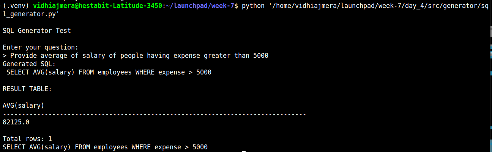

# SQL LLM Generator – End‑to‑End Pipeline
```
User Question
     ↓
Schema Loader (SQLite)
     ↓
LLM‑based SQL Generator
     ↓
SQL Validator (Safety Guardrails)
     ↓
SQLite Executor
     ↓
Result Table
     ↓
LLM‑based Result Summarizer
     ↓
Final Answer
```

---

## Project Structure

```
day_4/
├── src/
│   ├── data/
│   │   └── employee.db
│   ├── generator/
│   │   ├── llm_client.py
│   │   └── sql_generator.py
│   ├── utils/
│   │   ├── db_executor.py
│   │   ├── schema_loader.py
│   │   └── sql_validator.py
│   └── pipeline/
│       └── sql_qa_pipeline.py
└── README.md
```

## Step‑by‑Step Flow

### Schema Loading

File: `schema_loader.py`

* Reads SQLite metadata
* Extracts table and column names
* Converts schema into **LLM‑friendly text**

Example output:

```
Table employees: id (INTEGER), name (TEXT), age (INTEGER), salary (REAL), expense (REAL)
```

---

### Natural Language → SQL Generation

File: `sql_generator.py`

Uses an LLM to convert questions into SQL.

**Prompt Rules enforced:**

* Only `SELECT` queries
* Only one table
* No JOIN / UNION
* No explanation text
* SQLite‑compatible syntax

Example:

```
Question: Who earns more than the average salary?
Generated SQL:
SELECT name, salary FROM employees
WHERE salary > (SELECT AVG(salary) FROM employees);
```

---

### SQL Validation (Safety Guardrails)

File: `sql_validator.py`

Prevents unsafe or invalid queries:

✔ Only `SELECT`
✔ No `DROP`, `DELETE`, `UPDATE`, etc.
✔ Single SQL statement only
✔ Must contain `FROM`

This protects the database from destructive operations.

---

### SQL Execution

File: `db_executor.py`

* Connects to SQLite
* Executes validated SQL
* Fetches rows and column names

Returns:

```python
columns: List[str]
rows: List[Tuple]
```

---

### Result Summarization (LLM)

File: `sql_qa_pipeline.py`

The raw SQL output is converted into a **human‑readable explanation**.

Example:

```
"The result shows employees whose salary is above the company average."
```

---

## Example Run

```bash
python -m day_4.src.generator.sql_generator
```

## Supported Question Types



* Aggregations (AVG, SUM, COUNT)
* Filters (WHERE, BETWEEN)
* Rankings (ORDER BY, LIMIT)
* Subqueries
* Business logic (salary − expense)

Not supported:
* Delete Operation
* JOINs
* Multi‑table queries
* Write operations

---