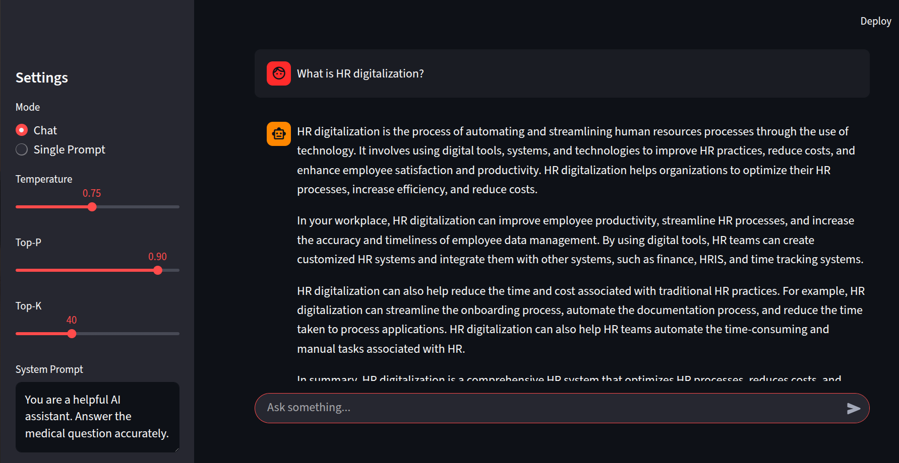

To run the server locally uvicorn deploy.app:app --host 0.0.0.0 --port 8000 To run the streamlit UI  streamlit run streamlit-app.py

Deploy Commands -
docker build -t local-llm-api .
Running the Docker container with port mapping docker run -p 8000:8000 -d local-llm-api
Implementations -
FastAPI inference server(Using llama-cpp )
Streamed generations
Used quantised model
Infinite chat mode
System + user prompts
Top-k, top-p, temp controls
the LLM recieves a history of prompts and response for the last 3 responses

Endpoints:
POST /generate
POST /chat 
