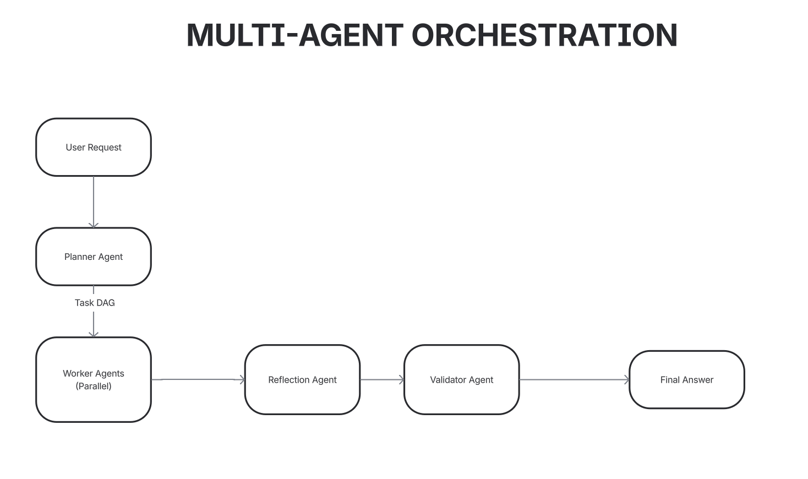

# Multi-Agent Planner–Executor Pipeline
**Agents:**

| Agent                |Role                     || -------------------- | ------------------------------------------------------------------------------- |
| **Planner Agent**    | Breaks the user request into atomic tasks and creates a DAG with dependencies.  |
| **Worker Agents**    | Execute individual tasks assigned by the planner in parallel whenever possible. |
| **Reflection Agent** | Reviews the merged output of all tasks, suggesting refinements.                 |
| **Validator Agent**  | Validates the final output for correctness, completeness, and quality.          |

---

## Architecture

## Key Components

### 1. Planner Agent

* Generates **atomic tasks** from a user query.
* Returns a **PlanModel**: list of tasks with IDs, descriptions, and dependencies.
* Enforces **sequential and parallel execution** through dependencies.

---

### 2. Worker Agents

* Dynamically created **1 per task**.
* Tasks with completed dependencies are **run in parallel** using `asyncio.gather()`.
* Workers execute independently, returning outputs for merging.

**Parallel Execution Example:**

* Task DAG dependencies:

  * `task_3` and `task_4` depend on `task_2`.
  * Both can execute **simultaneously** once `task_2` completes.

---

### 3. Reflection Agent

* Takes the **merged outputs** from all worker agents.
* Refines and improves the result before final validation.
* Optional but improves quality of answers.

---

### 4. Validator Agent

* Validates correctness, completeness, and quality.

---

## DAG-based Execution

* **DAG (Directed Acyclic Graph):** Represents task dependencies.
* **Task Status:** `PENDING`, `RUNNING`, `DONE`.
* **Execution Logic:**

  1. Identify ready tasks (dependencies complete).
  2. Assign ready tasks to worker agents.
  3. Run ready tasks in parallel.
  4. Update status to `DONE`.
  5. Repeat until all tasks are completed.

---
