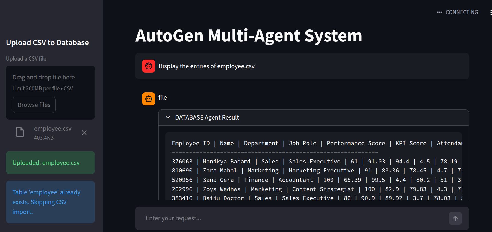

---
# Tool-Using Agents Architecture
---

## 1. Agents Overview

| Agent Name     | Tools / Responsibilities                                    | Example Usage                                 |
| -------------- | ----------------------------------------------------------- | --------------------------------------------- |
| **Code Agent** | Execute Python code snippets, calculations, data processing | Execute a transformation function on CSV data |
| **DB Agent**   | Query SQLite databases using SQL                            | Fetch sales data from `sales.db`              |
| **File Agent** | Read/write local `.txt` and `.csv` files                    | Read `sales.csv`, write processed insights    |

---

## 2. Workflow



**User Request:**

```
"Analyze sales.csv and generate top 5 insights"
```

**Execution Flow:**

1. **Orchestrator Agent** receives user query.
2. **Task decomposition**:

   * File Agent → read `sales.csv`
   * Code Agent → analyze data, generate insights
   * DB Agent → fetch any additional data if required
3. **Agents execute tasks independently**, using their respective tools.
4. **Intermediate results** written to shared memory / JSON files (`research.json`, `summary.json`).
5. **Orchestrator combines outputs** into a **final answer**.


---

## 3. Agent Responsibilities & File Structure

```
/tools/
    code_executor.py   # Python execution agent
    db_agent.py        # SQLite / SQL agent
    file_agent.py      # File read/write agent (.txt, .csv)
```

### 3.1 `code_executor.py`

* Executes Python functions provided by LLM or orchestrator.
* Handles computations, data analysis, transformations.

---

### 3.2 `db_agent.py`

* Queries local SQLite databases using SQL.
* Returns data to orchestrator or other agents.
---

### 3.3 `file_agent.py`

* Reads and writes local files (`.txt`, `.csv`).
* Provides data to Code Agent or other agents.

---

## 4. Orchestration Notes

* Orchestrator handles **task assignment and aggregation**.
* Agents **operate independently** and only interact via:

  * Direct API/tool calls
* Ensures **role isolation**, **modularity**, and **traceable workflow**.

---
