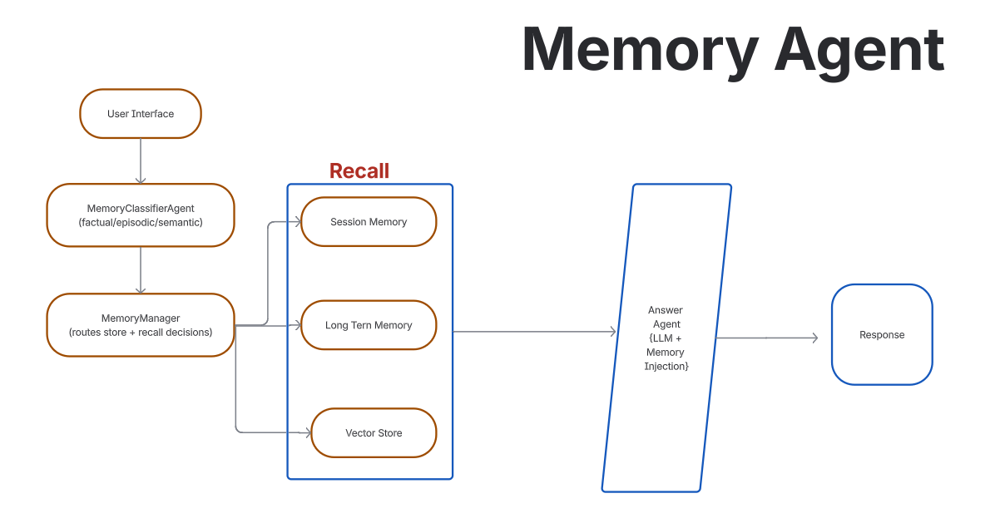

# Memory System — Multi-Agent Architecture

## Overview
This document describes the **Memory System** used in the multi-agent framework to enable contextual awareness, persistent knowledge, and similarity-based recall.

The system uses a **three-layer memory architecture**:
- Short-term (Session Memory)
- Long-term (Persistent Memory)
- Vector Memory (Semantic Recall)

---

## Learning Outcomes
- Maintain conversational context
- Persist important information
- Recall relevant past knowledge
- Distinguish episodic vs semantic memory

---

## Memory Types

### 1. Short-Term Memory (Session Memory)
**Purpose:** Maintain recent conversation context within a session.

**Key Points:**
- In-memory only
- Fixed window of last *N* turns
- Improves response coherence

**Stored Data:**
- Recent user and agent messages

**File:** `/memory/session_memory.py`

---

### 2. Long-Term Memory (Persistent Memory)
**Purpose:** Persist important summarized information across sessions.

**Key Points:**
- Stores summaries, not raw chats
- Explicitly retrieved when needed
- Durable storage

**Storage:** SQLite  
**File:** `/memory/long_term.db`

---

### 3. Vector Memory (Semantic Memory)
**Purpose:** Enable semantic similarity-based recall.

**Key Points:**
- Stores embeddings of summaries
- Supports similarity search
- Retrieves contextually relevant memory

**Technology:** FAISS  
**File:** `/memory/vector_store.py`

---

## Memory Retrieval Flow

User Query
↓
Vector Search (FAISS)
↓
Fetch Long-Term Memory
↓
Inject into Prompt
↓
Agent Execution
↓
Final Response