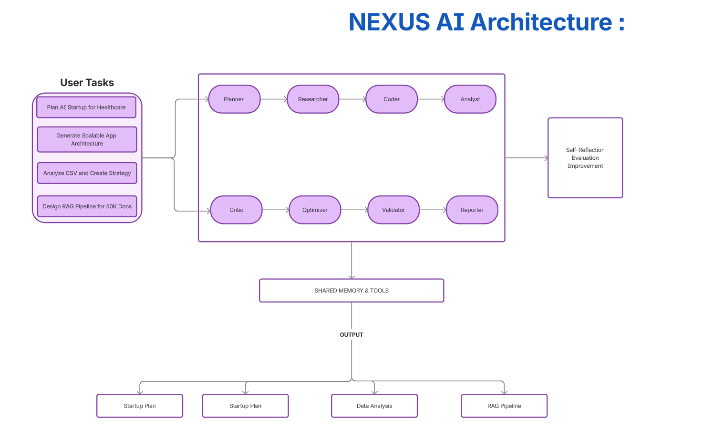

Build Master Agent System called:
PROJECT: NEXUS AI
Capabilities:
✔ Multi-agent orchestration
✔ Tool use
✔ Memory recall
✔ Self-reflection
✔ Self-improvement
✔ Multi-step planning
✔ Role switching
✔ Logs + Tracing
✔ Failure recovery
Example tasks it must solve:
1. “Plan a startup in AI for healthcare”
2. “Generate backend architecture for scalable app”
3. “Analyze CSV & create business strategy”
4. “Design a RAG pipeline for 50k documents”
Must contain these agents:
Agent
Orchestrator
Planner
Researcher
Coder
Analyst
Critic
Optimizer
Validator
Reporter